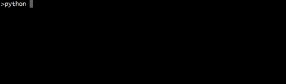

# BisTiming
A timing and progress bar module for Python.

## Installation
* Install `bistiming`
  ```bash
  pip install bistiming
  ```

* If you want to use `IterTimer`:
  * For Python < 3:

    ```
    pip install progressbar
    ```
  * For Python >= 3:

    ```
    pip install progressbar33
    ```

## Testing
* For the current environment: `python setup test`.
* For Python 2.7.12, 3.4.5, 3.5.2 and installation test: `tox`.

## Examples
* This module provide two context managers for timing: `SimpleTimer` and `IterTimer`.

### SimpleTimer
* See [examples/simple_timing_example.py](examples/simple_timing_example.py) for the examples of `SimpleTimer`.
* The output of executing `python examples/simple_timing_example.py`:
  

### IterTimer
* See [examples/progressbar_timing_example.py](examples/progressbar_timing_example.py) for the examples of `IterTimer`.
* The output of executing `python examples/progressbar_timing_example.py`:
  
